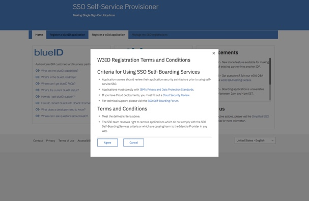
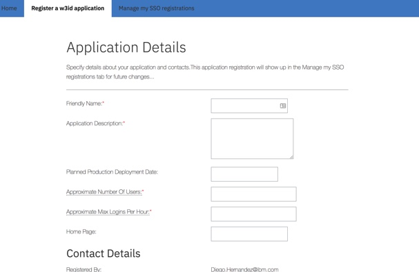
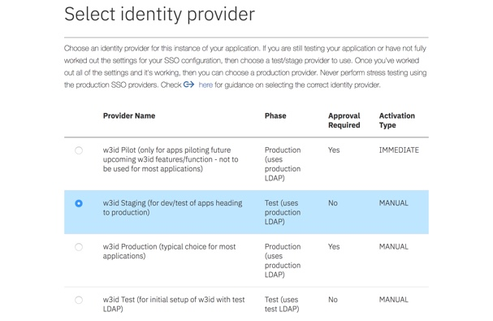
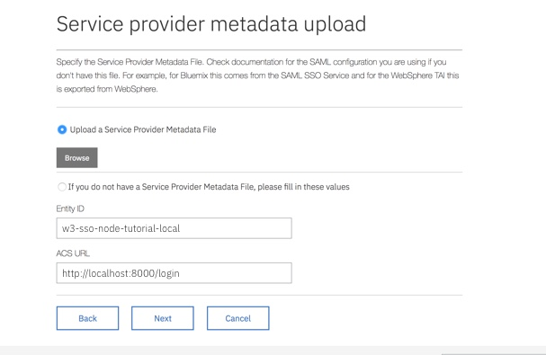
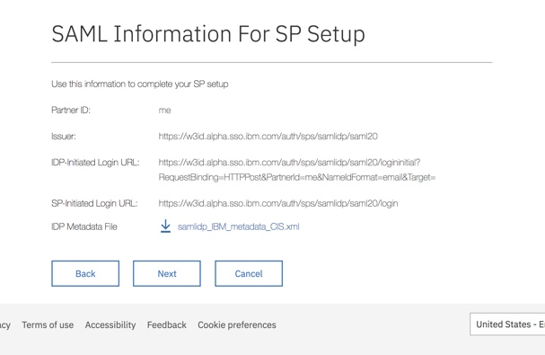
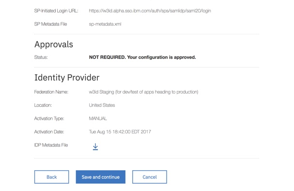

*NB: These instructions are based on an original set created by Diego Hernandez*

### Provision application IBM SSO service
In order to use the w3id authentication service, you must register your application with the IBM SSO Self-Service Provisioner. This will allow application to make requests to the w3id service and retrieve user data once a user is authenticated.

1. Log into the [IBM SSO Self-Service Provisioner](https://w3.innovate.ibm.com/tools/sso/home.html).

2. Click "Register w3id application" to start the process.

3. Read the Terms and Conditions and click "Agree".

  

4. Fill out the required Application Details and click "Next".

  

5. Select the "SAML 2.0" protocol and click "Next".

  

6. Since we are developing the authentication integration, select "w3id Staging" for the Identity Provider and click "Next". We will discuss production later in the tutorial.

  

7. Leave "Application Template" at "Default" and set the "Target Application URL" to your local development host and port. In the tutorial application it is "http://localhost:8000/". click "Next".

  

8. If you already have an SP metadata file to use, go ahead and uploaded. Otherwise, fill out your Entity ID and ACS URL. **Entity ID** refers to a unique ID that is used to identify this current configuration. I recommend your ID includes the word "local" or "development" so that it is easy to differentiate from future staging or production configurations. **[ACS](#assertion-consumer-server-acs) URL**  is the URL the IDP sends a `POST` request to your application with the user's information for Passport to authenticate. In the tutorial application it is `/login`. Click "Next".

  

9. Save the "Partner ID" and "IDP Initiated Login URL" somewhere later use. Also download the "IDP Metadata File" XML file. This file does not need to be downloaded into your application repository. You will need these values when configuring the Passport SAML strategy. Click "Next".

  

10. Review the configuration details and click "Save and Continue". The next page might take a while to load and that is okay. The provisioner is registering your application and local development configuration.

  

11. Keep an eye on the configuration you just created. It can take up to an hour for the configuration to become active. In the meantime, let's create some protected routes and get our application ready to integrate with this new SSO configuration.
